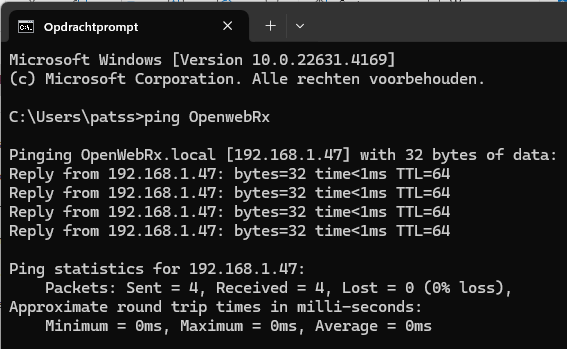
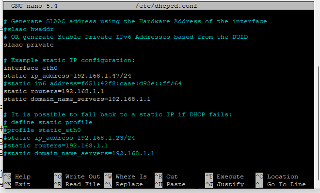

### OpenwebRX  Installatie & Configuratie door ON3PDY. ###
---
## Benodigdheden ##
      

[**Raspberry Pi**](https://www.kiwi-electronics.com/nl/raspberry-pi-boards-behuizingen-uitbreidingen-en-accessoires-59/raspberry-pi-5-4gb-11579?_gl=1*lkf79s*_up*MQ..&gclid=CjwKCAjw6c63BhAiEiwAF0EH1Hk4vvkVqG9C-TbIWwtMIr4HgenyoZ5aiTEVGVtE6QI5oQILqpdzXhoClmwQAvD_BwE)
Dit is een kleine singleboardcomputer met een ARM-processor. (afbeelding hier boven)

Deze zijn verkrijgbaar in verschillende versies.
Alle versies vanaf een V3 kunnen dienen voor dit project.

[**Behuizing & Koeling**](https://www.kiwi-electronics.com/nl/raspberry-pi-boards-behuizingen-uitbreidingen-en-accessoires-59/raspberry-pi-behuizing-voor-pi-5-zwart-11584?_gl=1*1a7n6vn*_up*MQ..&gclid=CjwKCAjw6c63BhAiEiwAF0EH1Hk4vvkVqG9C-TbIWwtMIr4HgenyoZ5aiTEVGVtE6QI5oQILqpdzXhoClmwQAvD_BwE)
behuizing voor de Raspberry Pi. +-10,95€

[**Voeding**](https://www.kiwi-electronics.com/nl/raspberry-pi-boards-behuizingen-uitbreidingen-en-accessoires-59/raspberry-pi-27w-usb-c-power-supply-zwart-eu-11582?_gl=1*p4xdg9*_up*MQ..&gclid=CjwKCAjw6c63BhAiEiwAF0EH1Hk4vvkVqG9C-TbIWwtMIr4HgenyoZ5aiTEVGVtE6QI5oQILqpdzXhoClmwQAvD_BwE)
Voeding 5.1V - minimum Ampere hangt af van de gebruikte Versie van Raspberry Pi.

[**SD kaart**](https://www.kiwi-electronics.com/nl/transcend-32gb-microsd-premium-class-10-uhs-i-plus-adapter-303?search=sd%20kaart)
MicroSD kaart minimaal 8Gb.

**S.D.R's**

SDR-dongles zijn oorspronkelijk ontworpen voor DVB-T HDTV-ontvangst, maar ze zijn prima bruikbaar als SDR.

[**RTL-SDR V3**](https://www.vandijkenelektronica.nl/product/rtl-sdr-v3-tcxo-dongle-500khz-1700mhz-sma-aansluiting/) +- 40€ (is wat ik in gebruik heb)

[**RTL-SDR V4**](https://www.vandijkenelektronica.nl/product/rtl-sdr-v4-tcxo-dongle-500khz-1700mhz-sma-aansluiting/) +- 47.50€ (geen ervaring mee!)

Persoonlijk heb ik deze modellen in mijn shack. 
- RTL-SDR
- SdrPlay

*kosten van dit project liggen +- rond de 150€ afhankelijk van de gemaakte keuze's en wat je mischien nog in de shack liggen hebt.*

**Programma's**
- [Raspberry Pi Imager](https://www.raspberrypi.com/software/)
- [PuTTY](https://www.chiark.greenend.org.uk/~sgtatham/putty/latest.html)

---

## Installatie ##

Download de laatste versie via volgende link: [OpenwebRx luarvique](https://github.com/luarvique/openwebrx/releases/)

Schrijf het bestand naar de **SD kaart** met behulp van het programma **Raspberry Pi Imager**

## Instellen van systeem gebruiker & paswoord! ##

Kies hier voor **AANPASSEN** om onderstaand dialoog te openen.

- *Hostnaam* ==> vrije keuze voorbeeld: demoSDR
- *Gebruikersnaam* ==> vrije keuze voorbeeld: demoUSR
- *Wachtwoord* ==> vrije keuze demo (opgelet deze is alleen voor het OS)
- *Wiffi instellen* ==> kan je eventueel overslaan maar kan wel handig zijn om straks te configuren.
- Regio instellingen *Tijdzone:* **Europa/Brussels** en *Toetsenbord indeling:* **be**

Kies **Opslaan** om deze gegevens te bewaren en toe te passen.

Klik op **ja** voor deze waarschuwing

De image wordt nu op de SDkaart geinstalleerd.

De installatie wordt geverifieerd

Verwijder de SDkaart uit je PC en klik op **VERDER GAAN**.

Om verbinding van op afstand te kunnen maken moet SSH nog worden geactiveerd.

Steek de SDkaart terug in je PC en maak een nieuw leeg tekstbestand aan in de root map met als naam **ssh** (zonder extentie!)

**De eerste opstart van OpenWebRx**

- Steek de SD kaart in de Raspberry PI.
- Sluit de RPI aan in het netwerk.
- sluit de SDR dongle aan op 1 van de USB poorten.
- Sluit de voeding aan en wacht tot deze is opgestart.

Als alles goed is verlopen kan je nu de OpenWebRx openen in je netwerk. **http://demosdr.local:8073/**

## Inloggen op de Raspberry Pi vanop afstand ##
Via een computer in het zelfde netwerk als deze van de Raspeberry Pi kan je inloggen via **SSH** met het programma **PuTTY**.

Hiervoor heb je volgende gegevens voor nodig.
- IP adres van de Raspberry Pi of de **hostname.local**
- gebruikersnaam
- Wachtwoord

De gebruikersnaam en paswoord is wat je hebt opgegegeven in de 'Raspberry Pi Imager'

IP adres: hier moeten we eerst opzoek gaan naar wat er via DHCP is toegekend aan de Raspberry Pi.

Via de opdrachtpromt (CMD) kunnen we dit vinden: ping de hostname die je hebt opgegegeven in 'Raspberry Pi Imager'

`ping OpenwebRX`

Aanbevolen is de RPI een vast IP adres geven. (niet verplicht)

Hiervoor doen we eerst wat opzoeken betrefende het netwerk waarmee we verbonden zijn.

Opniew gebruiken we hiervoor de opdrachtprompt (CMD)  

`ipconfig`

Scrol tot je de gegevens van de *Ethernet adapter* ziet. Noteer hier de **Default Gateway**

nu zijn we klaar om via **PuTTY** de instelling van de RPI aan te passen. Hiervoor heeft de RPI een ingebouwde editor. **NANO**

`sudo nano /etc/dhcpcd.conf`

zoek naar **Example static IP configuration van interface eth0** verwijder de # vooraan en pas het voorbeeld aan.

TIP: gebruik als static ip_address dat wat via DHCP is toegekend aan de Raspberry Pi. (zo ben je zeker van geen conflicten!).

static routers en static domain_name_servers daar gebruik je de **Default Gateway** die je hebt verkregen via **ipconfig**

- static ip_address=192.168.1.47/24 (opgelet /24 moet achteraan het gewenste IP adres staan!)
- static routers=192.168.1.1
- static domain_name_servers=192.168.1.1

Sluit af met de toetsencombinatie **CTRL+X** en bevestig met **Y**

Nu sluiten we de SDR dongle aan op een van de USB poorten en gaan we herstarten om dit alles te activeren.

`sudo reboot`

Eerst zorgen we dat het OS volledig up to date is.
`sudo apt-get update`

`sudo apt-get upgrade -y`

`sudo rpi-update` (eenmalig de firmware updaten als je werkt met een oudere RPI)

OpenWebRx web gebruiker en wachtwoord instellen (web interface)

`sudo openwebrx admin adduser XXXX` (XXXX vervangen door een gebruikersnaam en kies een paswoord)

`sudo openwebrx admin adduser` [username]            Add a new user

`sudo openwebrx admin removeuser` [username]         Remove an existing user

`sudo openwebrx admin resetpassword` [username]      Reset a user's password

`sudo openwebrx admin disableuser` [username]        Disable a user

`sudo openwebrx admin enableuser` [username]         Enable a user

`sudo openwebrx admin listusers`                     List enabled users

`sudo openwebrx admin hasuser`                       Test if a user exists

#installing digital modes

sudo install-softmbe.sh

**installing plugins**
https://github.com/0xAF/openwebrxplus-plugins
To load a plugin you need to create init.js file inside your openwebrx installation under htdocs/plugins/{type} folder. 
You can find the folder with this command:
`find / -name openwebrx.js`

You need to create/edit the init.js.
In the next example we will load receiver plugins.
First we need to create the init.js file:

OWRX_FOLDER=$(dirname `find / -name openwebrx.js`)
cd "$OWRX_FOLDER/plugins/receiver"
cp init.js.sample init.js
$EDITOR init.js

http://localhost:8073/

